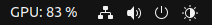

# NVIDIA View
This is a very basic extension to display GPU usage. This extension uses ``nvidia-smi`` to query memory utilization and display it.




**Note** : This extension only works for NVIDIA cards

## Installation

```sh
make install
```
## Testing

Use this script to run ``matmul`` on your nvidia gpu

```sh
conda create --prefix ./.conda python=3.10 -y
conda activate ./.conda
conda install pytorch pytorch-cuda=11.8 -c pytorch -c nvidia -y
python gpu_test.py --size 50000 --n 100
```

This should reflect gpu usage on the extension as it runs a ``50000x50000`` matrix ``100`` times. 

## Uninstall

```sh
make uninstall
```

## Manual Installation

1. **Copy the extension:**
    ```sh
    mkdir -p ~/.local/share/gnome-shell/extensions
	cp -r nvidiaview@aaronpp.in ~/.local/share/gnome-shell/extensions/
    ```


1. **Press ``Alt+F2`` and run the built-in ``restart`` command to restart GNOME Shell**

1. **Enable the extension:**
    ```sh
    sudo apt-get update
    sudo apt-get install gnome-shell-extensions
    gnome-extensions enable nvidiaview@aaronpp.in
    ```

1. **Monitor the output of GNOME Shell:**
    ```sh
    journalctl -f -o cat /usr/bin/gnome-shell
    ```

Loaded extensions are cached by the JavaScript engine. Therefore, after any change to the extension code, these steps have to be repeated to load the changes.


